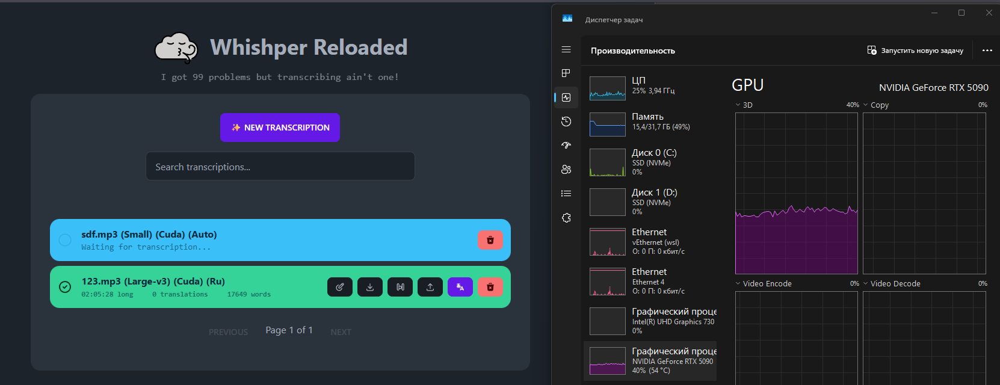

[](https://whishper.net)

**Whishper Reloaded** is an open-source, 100% local audio transcription and subtitling suite with a full-featured web UI. It is based on [Pluja's Whishper](https://github.com/pluja/whishper) and further improved.

## What's different?

- [x] Works with Nvidia RTX50* (cuda cuda:12.8.1)
- [x] Show info about model languages and device (cpu/cuda)
- [x] Show transcribtion time (!)


## Setup GPU (wsl example)

1. Install nvidia container toolkit https://docs.nvidia.com/datacenter/cloud-native/container-toolkit/latest/install-guide.html#linux-distributions


2. Configure docker for use gpu
```
sudo nvidia-ctk runtime configure --runtime=docker
sudo systemctl restart docker
```

3. Run docker-compose

```
docker compose up -d
```

4. Open browser (127.0.0.1 for wsl only! not localhost!)

Default port 8083 (see docker-compose.yml)

```
http://127.0.0.1:8083
```

## Docker-Compose with GPU example

The following is an example of a docker-compose.yml that puts backend, mongoDB and frontend on the same server, while whishper-api is hosted on a different machine:

```
version: "3.9"

services:
  mongo:
    image: mongo
    env_file:
      - .env
    restart: unless-stopped
    volumes:
      - ./whishper_data/db_data:/data/db
      - ./whishper_data/db_data/logs/:/var/log/mongodb/
    environment:
      MONGO_INITDB_ROOT_USERNAME: ${DB_USER:-whishper}
      MONGO_INITDB_ROOT_PASSWORD: ${DB_PASS:-whishper}
    expose:
      - 27017
    command: ['--logpath', '/var/log/mongodb/mongod.log']

  translate:
    container_name: whisper-libretranslate
    image: libretranslate/libretranslate:latest-cuda
    restart: unless-stopped
    volumes:
      - ./whishper_data/libretranslate/data:/home/libretranslate/.local/share
      - ./whishper_data/libretranslate/cache:/home/libretranslate/.local/cache
    env_file:
      - .env
    user: root
    tty: true
    environment:
      LT_DISABLE_WEB_UI: True
      LT_LOAD_ONLY: ${LT_LOAD_ONLY:-en,fr,es}
      LT_UPDATE_MODELS: True
    expose:
      - 5000
    networks:
      default:
        aliases:
          - translate
    deploy:
      resources:
        reservations:
          devices:
          - driver: nvidia
            count: all
            capabilities: [gpu]

  whishper:
    # pull_policy: always
    # image: pluja/whishper:${WHISHPER_VERSION:-latest-gpu}
    image: weslyg/whishper:latest
    env_file:
      - .env
    volumes:
      - ./whishper_data/uploads:/app/uploads
      - ./whishper_data/logs:/var/log/whishper
    container_name: whishper
    restart: unless-stopped
    networks:
      default:
        aliases:
          - whishper
    ports:
      - 8083:80
    depends_on:
      - mongo
      - translate
    environment:
      PUBLIC_INTERNAL_API_HOST: "http://127.0.0.1:80"
      PUBLIC_TRANSLATION_API_HOST: ""
      PUBLIC_API_HOST: ${WHISHPER_HOST:-}
      PUBLIC_WHISHPER_PROFILE: gpu
      WHISPER_MODELS_DIR: /app/models
      UPLOAD_DIR: /app/uploads
    deploy:
      resources:
        reservations:
          devices:
          - driver: nvidia
            count: all
            capabilities: [gpu]
```

The docker-compose.yml references two different env files, one for backend and another for frontend:

.backend.env:

    UPLOAD_DIR=/uploads
    ASR_ENDPOINT=<external-ip-address:8000> # assuming default port
    DB_USER=whishper # if default
    DB_PASS=whishper # if default
    DB_ENDPOINT=whishper-mongo:27017 
    TRANSLATION_ENDPOINT=<external-ip-address:5000> # assuming default port

.frontend.env:

    PUBLIC_API_HOST=<external-public-api-host>
    PUBLIC_TRANSLATION_API_HOST=<external-public-translation-api-host>
    PUBLIC_INTERNAL_API_HOST=http://whishper-backend:8080
    PUBLIC_WHISHPER_PROFILE=gpu # or cpu
    
# Original Whishper description

[](https://whishper.net)
[](https://whishper.net/guides/install)
[](#screenshots)
[](https://hub.docker.com/r/pluja/whishper)

